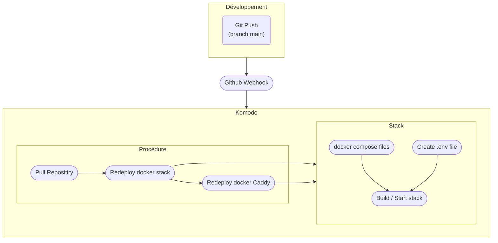

# Déploiement

J'utilise Komodo à la fois pour mon environnement de développement et mon environnement de production pour plus de simplicité et pour pouvoir tester ma stack en local facilement.
Prenons la stack prod sur Komodo :

- 1 Repos : aboul/aboulbox.com
- 1 Service = 1 Stack
- 1 Procédure pour la prod

## Production

### Push --\> Github Webhooks --\> Komodo

Chaque push sur mon repo github déclenche une procédure Komodo.

