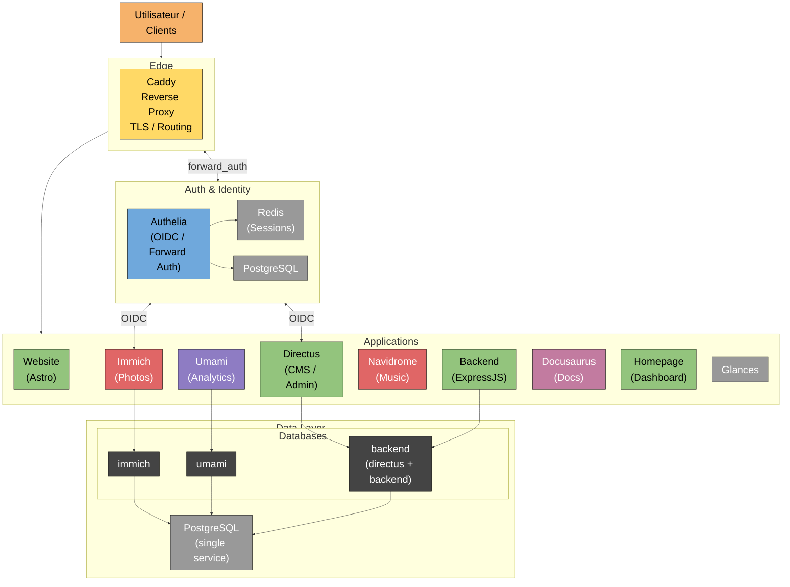

# Vue d'ensemble de la stack

## Services
- **[Caddy](Services/caddy)** : reverse proxy, TLS et routage des sous-domaines
- **[Authelia](Services/authelia)** : authentification OIDC, reverse_auth
  - **[DB Authelia](Services/database.md)** : base de données Postgres pour Authelia
  - **[Redis Authelia](Services/redis)** : redis pour Authelia
- **[Webite](Services/website)** : site web principal (framework Astro)
- **[Umami](Services/umami)** : analytics pour site web principtal
- **[Backend](Services/backend)** : endpoint pour formulaire de contact (expressJS)
- **[Directus](Services/directusd)** : CMS / backend
- **[Immich](Services/immmich)** : service photos
  - **[Redis](Services/redis)** : pour Immich
- **[Navidrome](Services/navidrome)** : musique
- **[Docusaurus](Services/docusaurus)** : documentation
- **[Homepage](Services/homepage)** : dashboard d'accueil
- **[Glances](Services/glances)** : monitoring simple
- **[Database](Services/database)** : base de donnée Postgres pour Umami, Immich, Directus / Backend

## Schéma réseau

